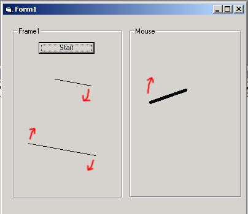



## \[\_   Line Rotate   \_\]

### Description

Rotate lines, by timer or by mouse move. PLEASE VOTE AND COMMENT!
 
### More Info
 

             |
---                |---
**Submitted On**   |2002-05-03 20:06:42
**By**             |[Tomas Tupy](https://github.com/Planet-Source-Code/PSCIndex/blob/master/ByAuthor/tomas-tupy.md)
**Level**          |Beginner
**User Rating**    |4.3 (69 globes from 16 users)
**Compatibility**  |VB 5\.0, VB 6\.0
**Category**       |[Graphics](https://github.com/Planet-Source-Code/PSCIndex/blob/master/ByCategory/graphics__1-46.md)
**World**          |[Visual Basic](https://github.com/Planet-Source-Code/PSCIndex/blob/master/ByWorld/visual-basic.md)
**Archive File**   |[Line\_Rotat79050532002\.zip](https://github.com/Planet-Source-Code/tomas-tupy-line-rotate__1-34429/archive/master.zip)

